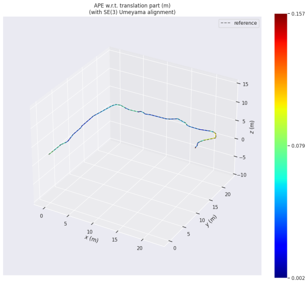
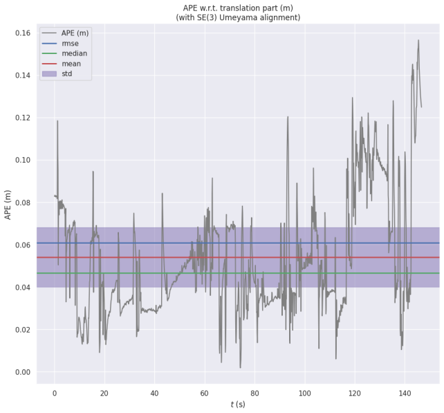

# ME5413 Final Project - Group 13

> **Authors:** [Blake Yang](https://github.com/HcBlackYang), [LINJIE](https://github.com/LINJIE-WANG)


## 📌 Project Overview

This project is part of the NUS ME5413 module. Our objective is to build a fully functional ROS system using a Jackal robot in a Gazebo simulated world. The system is capable of:

1. **Mapping the unknown environment** using SLAM with **Cartographer**.
2. **Navigating to target regions** using the `move_base` framework.
3. **Extracting meaningful semantic information** via advanced region extraction techniques.
4. **Crossing a randomly generated bridge**.
5. **Recognizing object labels using OCR**.
6. **Performing reasoning based on the environment** (e.g., counting boxes).
7. **Autonomous decision-making** to complete the final navigation task.


<p align="center">
  
</p>

<p align="center"><b>Figure 1:</b> Overview </p>

Demo：

<p align="center">
  
</p>

*If you have any questions, please feel free to contact us.*


## 🧠 System Architecture


Our system is composed of **7 functional modules**:

1. **Mapping Module** – SLAM using **Cartographer** to generate a 2D occupancy grid.
2. **Navigation Module** – Utilizes `move_base` with both global and local planners.
3. **Interactive Tools** – Provides an RViz panel for generating random obstacles and controlling the bridge.
4. **OCR Module** – Uses `pytesseract` and `cv_bridge` to recognize object labels.
5. **Region Extraction Module** – Processes occupancy grids to extract semantic regions.
6. **Bridge Controller** – Unlocks the bridge by publishing to the `/cmd_open_bridge` topic.
7. **Mission Coordinator** – Central logic for coordinating mapping, navigation, perception, and decision-making.

*For more detailed information, please refer to the full project report.*


## 📂 Repo Structure


This repository is organized as a `catkin` workspace and contains three major packages:

- **`interactive_tools`**: RViz and Gazebo interaction panels.
- **`jackal_description`**: Modified robot URDFs.
- **`me5413_world`**: Gazebo world, launch files, and supporting scripts.

*Note: Recent modifications in repository structure and dependencies have been incorporated according to the latest experimental results.*


## ⚙️ Dependencies


### System Requirements

- Ubuntu 20.04
- ROS Noetic
- C++11 (or higher)
- Python 3
- OpenCV
- `pytesseract`
- `cv_bridge`, `image_transport`

## 📦 ROS Packages

```bash
roscpp rospy tf2 tf2_ros tf2_geometry_msgs \
nav_msgs geometry_msgs std_msgs visualization_msgs \
rviz map_server move_base amcl gmapping \
pluginlib gazebo_ros \
jackal_gazebo jackal_navigation \
velodyne_simulator teleop_twist_keyboard \
jsk_rviz_plugins
```

> **Note**: Some dependencies have been updated to support the integration of **Cartographer** for SLAM.


## 🏗️ Gazebo Models

- **Gazebo Official Models**
- **Customized Models**


## 🔧 Installation


```bash
# Clone the repository
cd ~
git clone https://github.com/<YOUR_USERNAME>/ME5413_Final_Project.git
cd ME5413_Final_Project

# Install ROS dependencies
rosdep install --from-paths src --ignore-src -r -y

# Build the workspace
catkin_make
source devel/setup.bash
```

### Gazebo Models Setup

```bash
# Create the models directory
mkdir -p ~/.gazebo/models

# Clone official models
git clone https://github.com/osrf/gazebo_models.git
cp -r gazebo_models/* ~/.gazebo/models

# Copy customized models
cp -r ME5413_Final_Project/src/me5413_world/models/* ~/.gazebo/models
```


## 🚀 How to Use


### 0. Launch the Simulation World

```bash
roslaunch me5413_world world.launch
```

### 1. Teleoperation

```bash
roslaunch me5413_world manual.launch
```

Use keyboard teleoperation to manually explore the environment.

### 2. Mapping

```bash
roslaunch me5413_world mapping.launch
```

To save the generated map:

```bash
roscd me5413_world/maps/
rosrun map_server map_saver -f my_map map:=/map
```

### 3. Navigation

```bash
roslaunch me5413_world navigation.launch
```

Make sure `my_map.yaml` is loaded and AMCL is active.


## 🧪 Notable Features & Improvements


- **Cartographer-based Mapping**: Improved loop closure and global consistency.
- **Custom Region Extraction**: Dynamic identification of semantic regions using occupancy grid and costmap analysis.
- **Robust OCR Pipeline**: Pre-processing techniques improve recognition accuracy in noisy environments.
- **Automated Mission Coordination**: Python controller for centralized task scheduling and perception/decision integration.
- **Enhanced RViz Interface**: Real-time mission monitoring and user-friendly object tools.


## 📊 Trajectory Evaluation Using `evo`


<p align="center">
  
</p>

<p align="center"><b>Figure 1:</b> Absolute trajectory estimated by Cartographer</p>

<p align="center">
  
</p>

<p align="center"><b>Figure 2:</b> Loop closure and corrected path</p>


> For full evaluation details and additional results, please refer to the full project report.


## 🧩 Mission Execution Logic


1. **Initial Localization**  
   AMCL initializes localization via LiDAR scan matching using a pre-generated map.

2. **Region Extraction & Navigation**  
   Semantic region centroids are extracted from occupancy grid. Navigation is handled by `move_base`.

3. **Perception & OCR**  
   Robot captures images on arrival and extracts digits via an OCR pipeline.

4. **Bridge Traversal**  
   Robot opens bridge via publishing to `/cmd_open_bridge`.

5. **Decision-Making**  
   Based on digit frequencies, the system selects the target region.

6. **Docking & Task Completion**  
   Robot docks at the selected region to complete its mission.

> See the full report for detailed algorithmic flow.


## 📄 Contribution Guidelines

We follow:

- [Google C++ Style Guide](https://google.github.io/styleguide/cppguide.html)
- [ROS C++ Style Guide](https://index.ros.org/doc/ros2/Contributing/Developer-Guide/)


## 📑 Full Project Report

For in-depth explanation and results, refer to:

**`Group13_Report.pdf`**


## 📄 License

Released under the **MIT License**.

